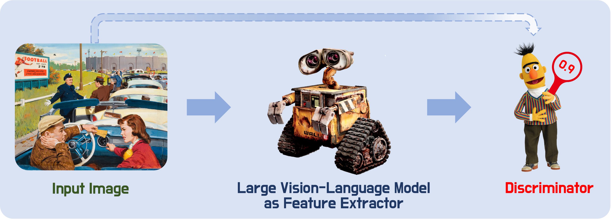

# Is Your Image a Good Storyteller?

# Abstract
Quantifying image complexity at the entity level is straightforward, but the assessment of semantic complexity has been largely overlooked. In fact, there are differences in semantic complexity across images. Images with richer semantics can tell vivid and engaging stories and offer a wide range of application scenarios. For example, the Cookie Theft picture is such a kind of image and is widely used to assess human language and cognitive abilities due to its higher semantic complexity. Additionally, semantically rich images can benefit the development of vision models, as images with limited semantics are becoming less challenging for them. However, such images are scarce, highlighting the need for a greater number of them. For instance, there is a need for more images like Cookie Theft to cater to people from different cultural backgrounds and eras. Assessing semantic complexity requires human experts and empirical evidence. Automatic evaluation of how semantically rich an image will be the first step of mining or generating more images with rich semantics, and benefit human cognitive assessment, Artificial Intelligence, and various other applications. In response, we propose the Image Semantic Assessment (ISA) task to address this problem. We introduce the first ISA dataset and a novel method that leverages language to solve this vision problem. Experiments on our dataset demonstrate the effectiveness of our approach.

# ISA Dataset

## Dataset Introduction

For each image in the ISA dataset, we annotate it with two scores: an Entity Score and a Semantic Score. 
They correspond to the Entity Complexity Scoring task and the Semantic Complexity Scoring task, respectively.

  
   
  Figure 1: Samples from the ISA dataset.

## Data Access

To get access to the data, you must sign a [Data Use Agreement (DUA)](https://docs.google.com/document/d/1F6qi0MlZFlWQCEH3pR1zXq5ZfWnHfTOV/edit?usp=sharing&ouid=111415446863054830984&rtpof=true&sd=true). Please read the DUA carefully, and send an email to xiujiesong@sjtu.edu.cn with the message: "I consent to the Data Usage Agreement of the ISA dataset." and attach the DUA including your handwritten signature in it.

# VLISA

VLISA has two components: a Feature Extractor and a Discriminator.
Specifically, we first use an LVLM (GPT-4o in this paper) as the Feature Extractor to extract semantic information in natural language form as features from images.
Then, we use a Discriminator model, such as BERT and ViLT, to rate the input image based on the extracted features, optionally including the image itself.

  
   
  Figure 2: VLISA.

